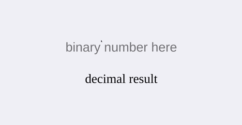
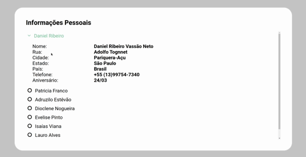
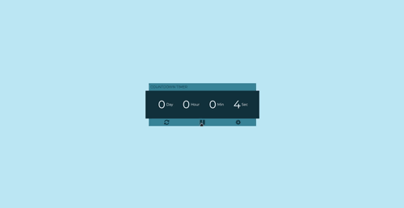
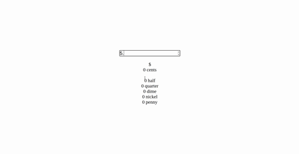
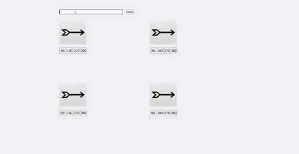

# App Ideas Beginner

Coleção de apps construídos com HTML, CSS e JavaScript para estudar desenvolvimento web.

## Bin2dec

> App web que converte um número binário para decimal de forma dinamica.

<h2 align="center">
  
</h2>

## Cause Effect App

> App web que simula uma lista de informações pessoais, que ao clicar em algum nome e mostra mais informações

<h2 align="center">
  
</h2>

## Countdown Timer app

> App web de um cronômetro.

<h2 align="center">
  
</h2>

## Dollar to cents

> App web que converte dollar para cents.

<h2 align="center">
  
</h2>

## Flip image

> App web em que você pode girar imagens.

<h2 align="center">
  
</h2>
