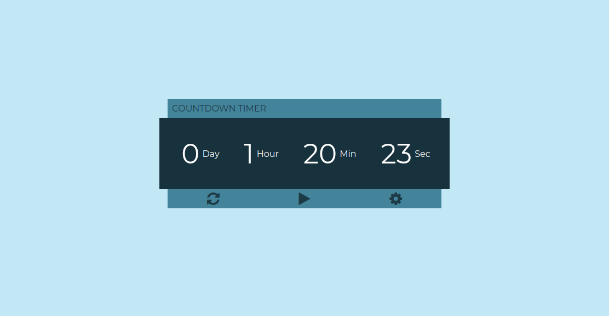

<h1 align="center">Countdown timer ⏲ </h1>

  
  

<h1 align="center">
  
</h1>

**Descrição**

> Timer construído com apenas HTML, CSS e JavaScript.

####  :slightly_smiling_face: Funcionalidades

- [x]  O usuário pode modificar os valores dos inputs dias, horas, minutos e segundos. (Botão de configuração)
- [x]  O usuário pode clicar no botão 'Iniciar' para ver o cronômetro começar a exibir os dias, horas, minutos e segundos até que o evento ocorra. O usuário pode ver os elementos no temporizador decrescente automaticamente. Por exemplo, quando a contagem de segundos restantes atingir 0, a contagem de minutos restantes diminuirá em 1 e os segundos começarão a contagem regressiva a partir de 59. Essa progressão deve ocorrer desde segundos até a posição de dias restantes na exibição da contagem regressiva.
- [x]  O usuário pode resetar o tempo para o valor que ele informou.
- [x]  O usuário pode ver um alerta quando o evento é atingido.

#### :thinking: Como usar

Você pode abrir o projeto com o Visual Studio Code e instalar uma extensão chamada [Live Server](https://marketplace.visualstudio.com/items?itemName=ritwickdey.LiveServer).

Ou simplesmente abrir o arquivo html no seu navegador favorito. 👊

#### Autor

👤 **Daniel Ribeiro**

- Twitter: [@defauth8](https://twitter.com/defauth8)
- Github: [@defauth8](https://github.com/defauth98)
- LinkedIn: [@daniel-ribeiro-397604164](https://linkedin.com/in/daniel-ribeiro-397604164)

